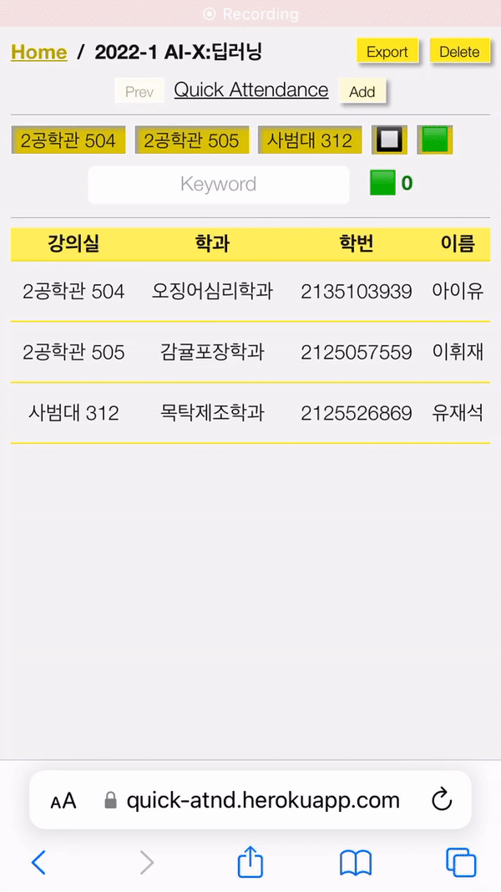

# [Quick Attendance](https://quick-atnd.herokuapp.com)

> Quickly and Correctly Check Attendance

|  |  |
| --- | --- |

## Abstract

Quick Attendance is a SPA(Single Page Application) that helps TAs to check
the attendance of the offline class. While moving around the classroom, they
can mark a student's status by simply asking his/her student ID or name. One
of the most convenient function it provides is initial search (초성검색 in Korean),
which makes it shorter to figure out the student. Through utilizing this
application, TAs are able to minimize the inconvenience of checking attendance
and, furthermore, the students will be less bothered by TAs and concentrate on
the lectures more.

**Index Terms** Single Page Application, Reactjs, Mobile, IndexedDB

## Motivation

When it was the first offline class of HY-LIVE, checking the attendance was
disaster. While moving around the class quietly and carefully, it heavily
demands to ask the students for their student card and match them with the
given roster. Even worse, the roster consisted with unordered names so it took
almost linear time to find their names. The correctness was also matter. If TA
had made some mistakes, there would have been a severe trouble later. In order
to reduce the workload and guarantee the attendance, this application will
have a significant role.

## Requirement Analysis

### Quick Searching

Finding the student by his/her personal information should be done as soons as
possible. To achieve this goal, searching by consonants for each letter is
strongly helpful. In addition, student ID will be the identifier to figure out
the student uniquely. If there are multiple students in a keyword,
highlighting the matching items help a user to distinguish the target.

### Marking

After finding the student, a user should be able to mark his/her attendance.
This step will be processed in one-touch. There is only a click button for
each student and its attendance is changed recursively after it is clicked.
There would be more than one mark. (e.g. "empty", "attend" and "late")

### Logging and Saving

Because attendance is sensitive for every students, all changes should be
recorded as much as possible. The logging mechanism should follow WAL(Write Ahead
Logging) principle. All logs also should be printed if necessary. In addition,
to prevent the loss of data, indexedDB in browser will be used.

### Exporting

All checked attendances should be moved to the official spreadsheet. The list
should be translated into korean within a single column, and its sequence
should be correspond to the roster.

## Development Environment

This Application is React Project. Primary dependencies are the belows;

* [react](https://www.npmjs.com/package/react)
  * [react-router-dom](https://www.npmjs.com/package/react-router)
  * [react-modal](https://www.npmjs.com/package/react-modal)
* [redux](https://www.npmjs.com/package/redux)
    * [redux-thunk](https://www.npmjs.com/package/redux-thunk)
* [dexie](https://www.npmjs.com/package/dexie)
* [hangul-js](https://www.npmjs.com/package/hangul-js)
* [node-sass](https://www.npmjs.com/package/node-sass)
* [classnames](https://www.npmjs.com/package/classnames)

## Architecture Implementation

### Persistent Layer

One of the most important things in this application is 'Persistent Layer'.
This is because all records and logs should be kept safely and correctly
reloaded in later. To achieve this purpose, 'JSON', IndexedDB' and 'localStorage' are
used behind the interaction with a user.

Static data, which is almost not changed, is loaded from JSON files. Those information
is imported by React components through helper fuctions. Since React reads all
JSON files during the start up, it is safe to say that there is no redundant
parsing and loading during the operations.

IndexedDB contains data which requires frequent transactions and also should
be stored safely. IndexedDB is the best choice to serve this data because it
supports almost permanant storage and read & write transactions. There is
another advantage to use IndexedDB, which is provides index key. That is, it
is faster to fetch a single data or sorted lists.

All requests and responses of transactions are recorded in localStorage.
Logging repository is not an indexedDB because the failures of
indexedDB should be captured by another storage. The key of log record consists
of timestamp, transaction type and random string.

### IndexedDB Schema

The schema of indexedDB is the below.

| Table Name | Key                                                                    |
| ---------- | ---------------------------------------------------------------------- |
| pages      | cid(PK, Int), label(Str)                                               |
| students   | sid(PK, Str), cid(IDX, Int), row(Int), rid(Int), major(Str), name(Str) |
| marks      | mid(PK, Int), pid_sid(IDX, Str), mcd(Str)                              |

### React Components

The following diagram describes React components in this application.

| File           | Description                                              |
| -------------- | -------------------------------------------------------- |
| ClassList.jsx  | Intro page. Provides list of classes and links.          |
| AtndLayout.jsx | Outermost layout of attendance page.                     |
| AtndHeader.jsx | Top bar. Contains class name, page name and its buttons. |
| AtndFilter.jsx | Filter bar. Select specific rooms, marks and keyword.    |
| AtndRoster.jsx | List of attendance. Click to change the student's mark.  |
| Export.jsx     | Export of attendance. Viewed as modal.                   |
| Log.jsx        | Log viewer.                                              |
| LogFilter.jsx  | Log filter.                                              |

### Redux Reducers

Next diagram shows the states of Redux's reducers.

| Reducer          | State                                                    |
| ---------------- | -------------------------------------------------------- |
| paramReducer     | aClass(Obj), page(Obj), showExport(Bool), tryMark(Bool)  |
| filterReducer    | rooms(Arr), marks(Arr), keyword(Str)                     |
| rosterReducer    | students(Arr), atnds(Arr)                                |
| logFilterReducer | date(String), pos(Arr), tblNm(Arr), type(Arr), sid(Str)  |

## Specifications

### Startup

* Initialize Database
  * When the browser trys to open the application at first time, all
    predefined stores will be created and corresponding initial records
    will be inserted. Especially, the default 'page' will be created
    for each class.
* Intro Page
  * After finishing the initialization, a user can see the `ClassList`. It
    will shows all classes' names.

### Page

* Open a page
  * In the `ClassList`, when a user clicks one of the classes, the `AtndLayout`
    will be displayed with the latest page of that class. It consists of
    `AtndHeader`, `AtndFilter` and `AtndRoster`.
* Add new page
  * In the `AtndHeader`, when pressing the 'Add' button, new page of the class
    will be created. It's name is current timestamp in default. There is no
    attendance marks in initial state.
* Change the page name
  * In the `AtndHeader`, the prompt window will be shown if a user clicks the
    name of the page. If there is no change or a user clicks 'cancel', the
    name won't be altered. Otherwise, the user-typed name will be updated to
    the page and the display label also will be changed immediately.
* Move page
  * In the `AtndHeader`, the page will be changed if a user clicks 'Prev' or
    'Next' button. If there is no previous page, the 'Prev' button will appear
    disabled. And also there is no further page, the 'Next' button will be
    replaced with 'Add' button, which works for adding a new page.
* Delete page
  * In the `AtndHeader`, if 'delete' button is clicked, the pages and
    corresponding attendance marks will be deleted. If the target to be
    deleted is the sole of the class, a user can't proceed it. Alternatively,
    the alert will appear.

### Filtering

* Show students with marks
  * In the `AtndRoster`, the list of students in the class will appear for
    each table row. The row's color indicates the current mark of the student.
    (e.g. transparent means no mark and green means marked). If there are
    filtering conditions, the filtered result will be shown.
* Filtering the list
  * In the `AtndFilter`, there are two types of filters; 'rooms' and 'marks'.
    There will be toggle buttons for each room where the class is held. In
    addition, the available marks will appear. If a user clicks any of the
    buttons, the filtering conditions will be changed.
* Search by keyword
  * In the `AtndFilter`, input textbox is located. It supports any characters
    and searchable items are the students' IDs and names. The initial search
    (초성검색) is available too. If the keyword is empty, it accepts all
    students. However there is some characters, it will filter the results.

### Marking

* Click the row
  * In the `AtndRoster`, a user can change the student's attendance by
    clicking the row. After clicking, the row color will be changed. If
    clicking again, the next status of the marks will be set recursively.
* Press Enter in keyword
  * In the `AtndFilter`, if a user types any keyword and there is the only
    students after filtering, pressing enter will trigger changing the
    student's mark. If there is no results or more than one, it won't work.
* Logging
  * Before and after the marking, all transactions will be recorded in
    IndexedDB. The log record contains the timestamp, transaction type and
    request/response data. If there is failure occurs instead of response, it
    will also be saved.

### Others

* Show Exports
  * In the `AtndHeader`, the export modal will appear after clicking the
    'Export' button. The top of modal contains the name of class and page. The
    body contains two textarea, which is one is row and student name, the
    other is label of the student. The label textarea is editable so a user
    can copy the content.
* Show Logs
  * In the `ClassList`, a user can press the 'Log' button. If it is clicked,
    the `Log` will appear. There is `LogFilter` which includes filterings;
    date, pos, tblNm, type and sid.
* Reset database
  * In the `ClassList`, there is a 'Reset' button. It triggers deleting all
    records kept in indexedDB and restoring the initial data. The logs stored
    in localStorage won't be removed by clicking the button.
